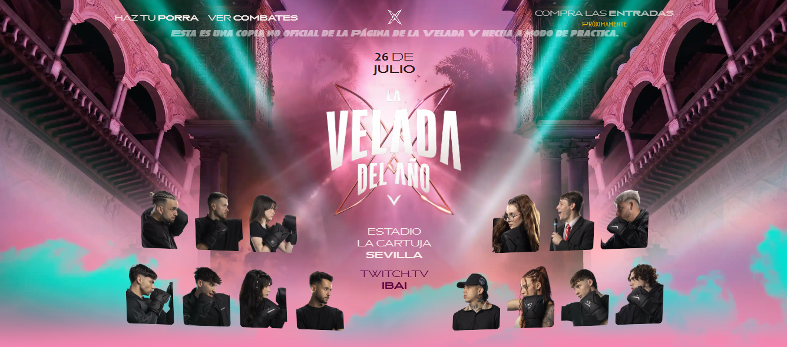

# 🥊 La Desvelada - Versión inspirada en La Velada del Año V



Este es un proyecto web inspirado en *La Velada del Año V* de Ibai, adaptado con estilo propio. Está construido con [Astro](https://astro.build/) y desplegado en [Netlify](https://netlify.com/).

---

## 🚀 Tecnologías utilizadas

- ⚡ Astro 5
- ☁️ Netlify con adaptador oficial
- 🧩 ClientRouter para rutas dinámicas
- 🛠️ pnpm para manejo de dependencias

---

## 📦 Instalación

1. Clona el repo:

```bash
git clone https://github.com/tu-usuario/la-desvelada.git
cd la-desvelada
